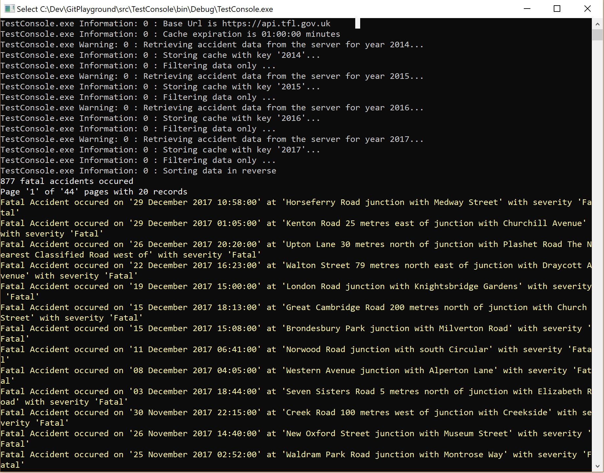
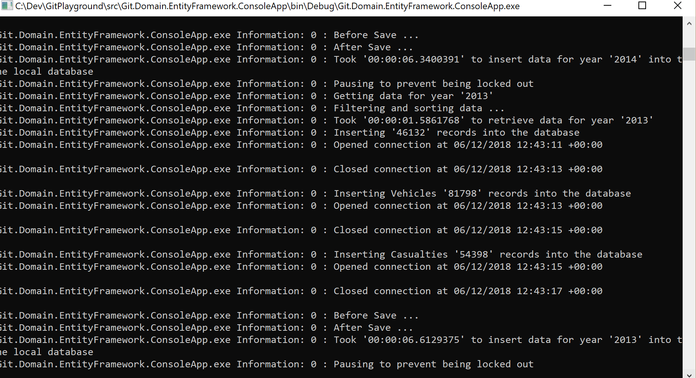
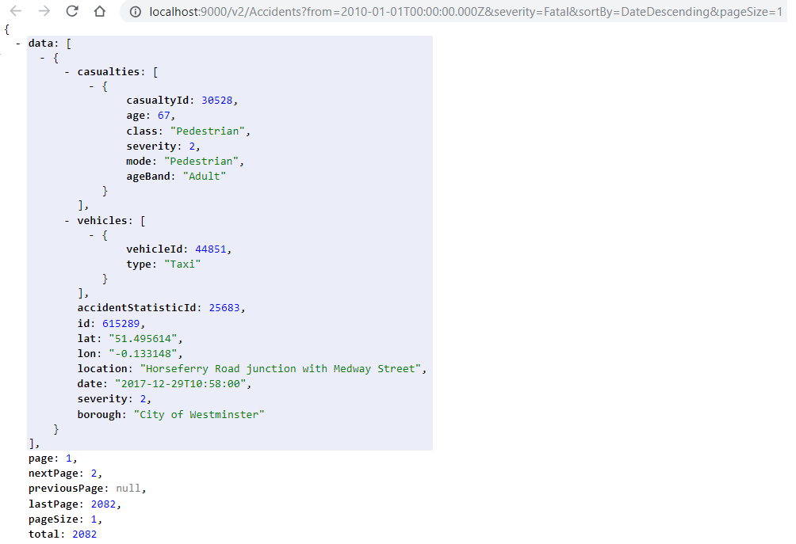
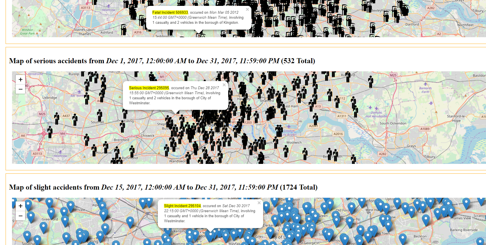
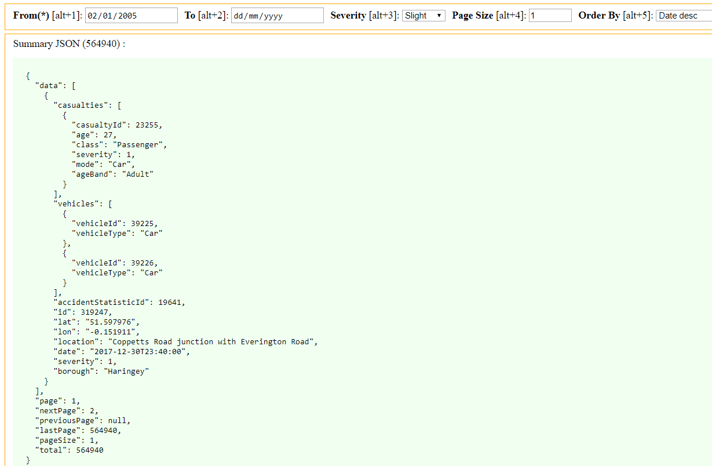
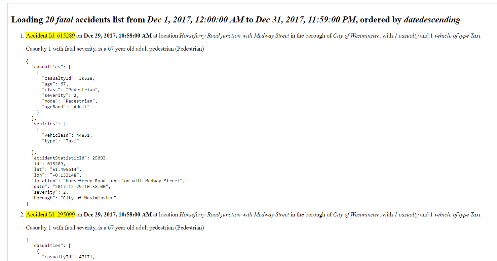
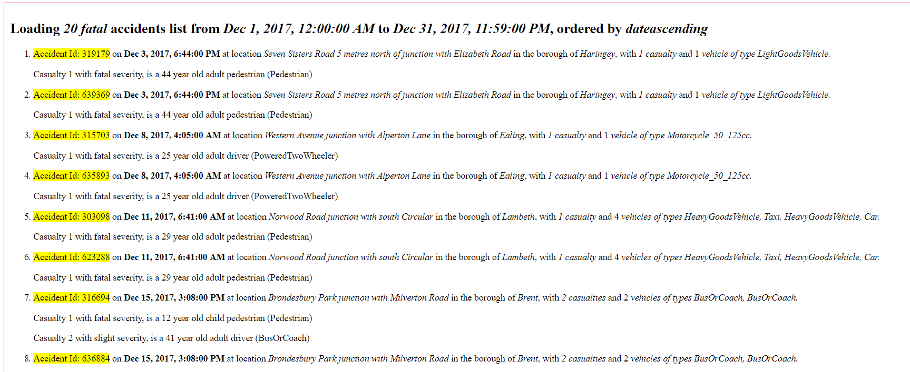

# Welcome to your first indaba
So you may be asking what is an indaba? As a native South African, I have often used this term out of context, but appropriatly, at least in this context. Officially an indaba is an important meeting or conference held by the Zulu or Xhosa people. However we South African's overload this by saying "that is your Indaba my bru", meaning good luck and you should solve this what ever desperate way you can.

So what does this have to do with the Git Playground? This is a series of real-world Katas, or soon to become, and for you that is about chosing how you solve your indaba. An indaba is really a marathon Kata exercising a lot of real world issues.
Essentially the gist of it is below and if you are interested in how it is solved by me, look at my indaba src within the repository. Good luck my bru or sister!

# Transport For London Indaba

Transport for London have created an endpoint that returns an abundance of data without options to paginate, filter, sort or cache data. You can see more about this api here within the [api.tfl.gov.uk](https://api.tfl.gov.uk/swagger/ui/index.html?url=/swagger/docs/v1#!/AccidentStats/AccidentStats_Get). Thank you London TFL for hosting this huge Api to help us have our first Indaba and to make it better for you.

This Api is a great way to exercise real world solutions, for not only creating better Api's, but also to exercise different skills in  solving the Api issue.

My original reason for stumbling across this Api was to find some statistics about my menacing cycle route through London city traffic, to work out where I should cycle safely and what roads I should avoid. This Api was a little tricky in helping me safe-up my route and returned almost 49000 records per year at once, with no option to filter or return the data in some other useful order. I thought this is agood opportunity to create a full stack, partial or minimal solution depending on which Indaba you decide to endure down.

Full stack indaba is a *Marathon Indaba* making you a *Shaka Zulu*. Solving the front-end using my backend solution, or the data part only, or the domain logic is more a 5 km run to half marathon, making you a *Senzangakona*. If you just want to learn about how I solved it, academic or for another reason I cant fathom, you will just have to be a *Voortrekker* in the face of all this so endure on!

This is an opportunity to create a client that could do all of this through whatever mechanisms you chose. Remember to test
drive your solution and if you are going to follow anything, make sure it is the KISS principle to make this better than it is.

## Domain indaba
This is essentially the heart of the project or the core of your domain.

1. Create a domain to facilitate any core domain logic to solve your problem or a model to serialize the data into.
2. Create a unit test to drive the development of the specific class, mocking any dependencies where possible.
3. Create an acceptance test that simply tests the full stack with anything you want to define as a requirement, try not call the live TFL Api too much or you will be locked out of the site with a denial of service attack, which may come as a result of fast paced tests firing at the server rapidly making AWS think you are attacking the site. I experienced this when I added more outside-in tests than I needed. So where possible follow a traditional test pyramid and keep the acceptance test to a minimum, ideally driving outside-in with tests until you have a final solution.
4. Create a simple console application that will consume the domain, and show some visuals on a part of the data you may be interested in, like fatal accidents between a period of time, cycling deaths since the beginning of its time.
5. There are a few constraints that need to be adhered to. There is only data between 2004 and the last year and not the current year. I am not sure when 2018 data will be available, but your logic should cater querying last year data as the max.

## Database indaba
Are you a back-end kinda guy, a database repository specialist who likes storing and querying bits and bytes. 

1. Use the persistent or ephemiral storage of your choice, represent the accident artifacts and seed the data from the live site into some durable layer.
2. The database must have some automation layer for setting up dynamically as well as seeding the data on the first run of the system. Add a *README* to help describe what needs to be done.
3. Create a readonly repository repsonsible for reading the data so that it can be accessed via some web api.

## Api indaba
This is the new and improved Api. Use Nancy, Node or any other Api project you feel comfortable using.

1. Recreate the Api allowing for options to query the TFL data for the purposes of what you want the data to do. You need to use the domain to show data and so any caching or optimisations need to be configured through the Api contract. Remember this needs to be able to run through a browser or postman so allow for a simple and intuitive user experience.
2. Create two versions possibly that use the live site data and possibly your own data, if you have done an optimised database solution.

## Front-end indaba
This is a visualisation of the data, creating business reasons for consuming this Api.

1. You may need to create an Api to host the query mechanism, see the Api indaba for more information.
2. Create several components allowing different views on the data, like a query component, or a map component or a list component describing the accidents between a certain data by a certain severity.

## Study indaba
Do not look at this if you want to solve this on your own. This is my indaba and will explain roughly how I chose to solve my problem.

### Set up development environments

1. This assumes you have Visual studio or VSCode. The solution used .Net framework 4.6.2 but I could have easily done this in .net core, just chose to do it this way as I was testing FLURL and Bddfy for a project that was not using .net core and so I continued down this route.
	1. Download the git source.
	2. Open *GitPlayground.sln* in the root of the project.
	3. **NOTE:** some of the tests will need to be fixed because they rely on live data and your environment may be synchronised differently, or possibly not setup at all. The TFL site has dynamic data, mainly two versions of the data depending on the load balancer you hit. I have created tests that will be easy to repair json data using your locally configured compare tool and when the compare fails for difference, just synchronise what is on your local setup.
	4. **The TestConsole** is the simplest solution for solving the domain problem, and the poormans UI for looking at how it works, other than the tests. The console will simply load the Transport for London client using an autofac dependency injection framework and show severe fatalities between 2014 and 2017. All the trace outputs will be logged to the window showing when this is loading from the server or when being loaded from my custom in memory cache, and then will run through the details one page at a time. The console will pause at the end for you to scroll through the data to view what happened.
	
	5. **The domain** data serialized the data into poco classes. I tried initially to get away with doing it into a dynamic object, to see if I could get away with doing nothing, but in the end I felt it was beneficial to have this strongly typed as dynamic can be clunky. I chose to use Flurl as I usually take time to create an HtmlClient builder, and then tests to support this and I found that in the end I created the same thing that looks like Flurl's ugly cousin. Creating it from scratch may have been useful for this exercise but I say pick your battles. This is a very useful library and has a nice testing interface which I exercised within my own tests. Feel free to use the standard .net HttpClient, as this does nothing more than create a builder and make testing easier when mocking http endpoints. I included custom caching objects, sorting comparers, configuration extensions and various things to make a simple project more intersting. In your indaba, create what challenges you and your goals you want to face and drive ... like you stole it.
	6. **The database project** utilises entity framework code first. To setup the database run *Git.Domain.EntityFramework.ConsoleApp* project and when it is loading, it will automatically create and seed all the data neded to run this project. The database takes two minutes per year to generate, taking roughly 30 minutes on a good setup, but feel free to cancel when you have generated some data to run things with. There may be tests that will start failing, just repair or ignore them until you have time or interest to generate the entire data stack from the seed. The other small issue is the seed is generated from the live server data and so the data does change from time to time, especially when 2018 data comes into fruition. The same data can be generated from running the *Git.Domain.Owin.Api* too so if you want to bypass the console, feel free. This is was the first consumer of the project, before the *Owin.Api* version 2.0 Api was enhanced to expose this. Here is more information on an interesting blog for a full repository and some good practises [Repository blog](http://blog.gauffin.org/2013/01/repository-pattern-done-right/). Below is a typical example of what the console states when seeding the data. If you run the Api, it will probably output this information in the Visual Studio output debug window.
					
	7. **The git.domain.owin.api** is a self Hosting Owin Api run in a simple console application. It simply stays up by virtue of a *console readline*, and would usually be done more robustly as a service, or using [Topshelf](http://topshelf-project.com), where you can configure the application in different modes using console arguments. The Api is self documenting with the swagger option visible in the console, but I can say that it needs love and caring and is mostly just there to show an entry. CORS is the first thing you will need if a front-end will need to call the service you can see how I included customisations to easilly configure projects. I could query any bits of data exposed in my api through simple human readbale mechanisms making it intuitive to use through a browser.
	
		1. A few more links of interest for anyone wanting to self host, see [Owin self host](https://docs.microsoft.com/en-us/aspnet/web-api/overview/hosting-aspnet-web-api/use-owin-to-self-host-web-api).
		2. Autofac and Owin see [integrating autofac into the Owin pipeline](https://autofaccn.readthedocs.io/en/latest/integration/owin.html).
		3. Setting up Swagger see [Swashbuckle](https://github.com/domaindrivendev/Swashbuckle).
		4. Setting up Web Api 2 see [ASPNet Web Api 2 release notes](https://docs.microsoft.com/en-us/aspnet/visual-studio/overview/2013/release-notes#TOC11)
		5. Webhosting see [Configuring Web API with ASP.NET Hosting](https://docs.microsoft.com/en-us/aspnet/web-api/overview/advanced/configuring-aspnet-web-api#webhost)
		6. More information on CORS see [Enable cross-origin requests in ASP.NET Web API 2](https://docs.microsoft.com/en-us/aspnet/web-api/overview/security/enabling-cross-origin-requests-in-web-api)
		7. The caching mechanism is very simple to implement, and here is an example of the source library I utilised. I could have developed this with my memory caching mechanism in my domain, but did not want to spend time creating attributes and testing this so I chose this library because it is very configurable. [Source code to the library I consumed](https://github.com/filipw/Strathweb.CacheOutput)
	8. My angular project was written using vs code and with latest Angular Cli to produce an Angular 7 ngAccidentStatistics project, but feel free to use an editor of your choice that works well with node. For setup and project details see more within [src/ngAccidentStatistics](src/ngAccidentStatistics), related to installing the latest version of Node and the Angular CLI. I use a bespoke testing mechansims that work for me, creating a testing folder to represent every component/service I will create. I think this project gives you a taste for all sorts.
		1. The first component is a map component visualising the different dates, map settings, severity and visual configurations using the Leaf map library, which I think is fantastic and open source. I even included the Geolocation framework to set your position, but  this is only because I am doing a certification on this stuff and wanted an excuse to use it, so play hard with it like I did.
		
		2. The next component allows me to query the data and visualise the output. There is nothing to it except the fact that I do not limit the amount of data being returned. This was done intentionally for you to see speeds and issues, but in a production system, you should always add logic to restrict this, so TFL can laugh at my poor decision not to do this, as we retrieve lots of data for no good reason. Another poor aspect to my solution is I have database Id's serialized out and did not chose to remove the data or create some sort of data transfer object to represent this data. My decision was based on speed of data generation, and could have chosen to include a *jsonignore* attribute on those values but decided I would output the values until its a problem - don't do this in a production solution. The query component is now the only component that can query my version 1.0 and 2.0 API, which still interacts with the live server utilising my caching enhancements, a representation of a solutioon where it is not possible to own this data, and the final which is in my persistence layer and totally in my control.
		
		3. The final component is a list component describing what happened. This is also evident in the popup on maps. What is still bad, and will be resolved soon, is the strange enumerated values to represent the vehicle types and modes. I will solve this for both Api's but I had more pressing things to achieve.
		
		
	9. My react project is going to be developed using vscode as a typescript project. For setup and project details see more within [src/react-accident-statistics](src/react-accident-statistics). Watch this space as it unravels.

# summary
Enjoy doing Indabas and remember solving small issues well helps give you a spear for bigger problems.
Umkhonto we sizwe a nd good luck!

# Things to do myself and brain dump space
This is my untidy area on the page that will just stay a mess until I move what I think is useful into the correct places. 

	Extends with swagger, pact or typemock tests

	Fix RFC3986-compliant issues

Add in Angula README
https://github.com/angular/angular-cli/wiki

https://alligator.io/angular/testing-httpclient/

Start coming up with ideas for lightning talks

TODO: Create a react client doing the same thing to compare and do it in typescript
	
	Follow the instructions for generating the base typescript project https://github.com/Microsoft/TypeScript-React-Starter

	https://airbnb.io/enzyme/docs/installation/index.html for setting up enzyme
